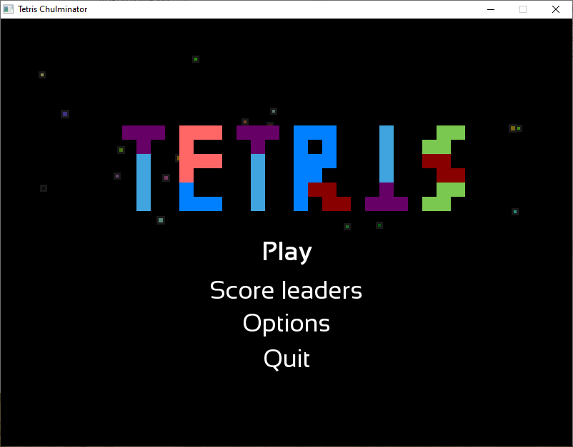

# TetrisChulminator_public
## Overview



## Key Features
Scoring System: Records player scores and saves high scores to add a competitive element.

Visual Effects: Enhances immersion with appealing graphics and animations.

User Interface: Designed with an intuitive UI for easy game initiation and controls.

## Tech Stack

Programming Language: Modern C++ (MinGW32 Windows)

Library: SFML

## Copyrights
- SoundSource:
  - [DorianYellow](https://github.com/DorianYellow)
  - YFW개코
  - HSK
  - https://sound-effects.bbcrewind.co.uk/
  - https://taira-komori.jpn.org/playing01kr.html
- MusicSource:
  - [DorianYellow](https://github.com/DorianYellow)
  - [DorianYellow](https://github.com/DorianYellow)
  - Odd News - Twin Musicom

```text
Odd News by Twin Musicom is licensed under a Creative Commons Attribution 4.0 license. 

https://creativecommons.org/licenses/by/4.0/

Artist: http://www.twinmusicom.org/
```


- FontSource
    - BalonkuRegular-la1w
      - license: Shareware, Non-Commercial
      - link: https://www.fontspace.com/balonku-font-f31178
    - Sansation
      - SIL OPEN FONT LICENSE Version 1.1 - 26 February 2007
      - link: https://www.fontsquirrel.com/license/sansation
